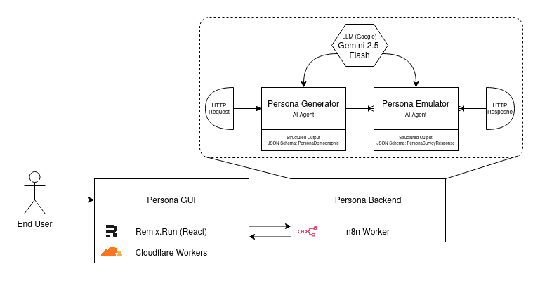

# Persona

**_AI-Powered Market Research and Customer Persona Simulation Platform_**

### :rocket: Overview

Persona helps businesses and marketers rapidly validate ideas, understand customer needs, and create detailed customer personas using advanced AI agents. Instead of waiting for slow and expensive market research, Persona provides instant insights and simulations based on real-world data.

### :sparkles: Key Features

- **AI-Driven Persona Generation:** Leverage cutting-edge generative agentic AI to create accurate and detailed customer personas based on various demographics, behaviors, and preferences.
- **Instant Market Research:** Conduct market research in minutes rather than weeks, allowing for quick validation of ideas and strategies.
- **Customizable Research Parameters:** Tailor your research to specific industries, customer segments, and geographic regions
- **Get the Full Picture:** Chat with your generated personas to understand their motivations, pain points, and decision-making processes.

### :jigsaw: Technical Architecture

Persona uses a variety of modern technologies to deliver its features. These include

#### Frontend

- React Router v7
- TailwindCSS
- JavaScript/TypeScript
- Vite
- Lucide Icons

#### Backend

- Node.js
- Cloudflare Pages
- Cloudflare Workers

#### Agentic GenAI

- Google Gemini 2.5 Flash (Base LLM)
- OpenRouter
- n8n (Workflow Automation)

